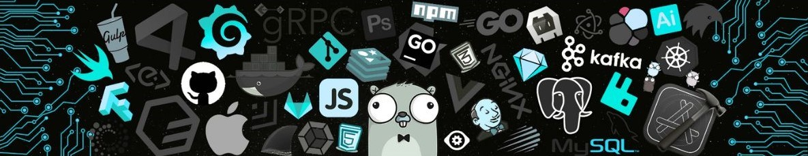

   

<!--  -->
 
<h1 align="center">Hello 👋, I'm Arpita Dhamange</h1>
<h3 align="center">Software Developer | Full-Stack & Embedded Systems Specialist</h3>

  
     Full-Stack & Embedded Systems Developer with hands-on experience as an SDE Intern at Amar Machine Tools and Senior Web Developer at KeyNcoders Innovations. Skilled in delivering robust software and IoT solutions, managing complete SDLC, and optimizing both frontend and backend system performance. Versatile in MERN, Next.js, Three.js, and cloud technologies, with a strong foundation in data structures, algorithms, and database design. Pursuing B.Tech in Electronics & Communication Engineering (VIT, ’26).

 
 
